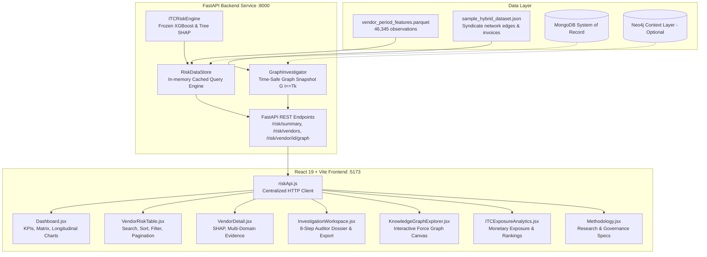

# Dashboard Architecture & Technical Design

## 1. System Architecture Diagram

---

## 2. In-Memory Cached Data Store (`RiskDataStore`)

To satisfy strict sub-100ms dashboard latency requirements across 46,345 records without repetitive disk operations:
1. **Singleton Pattern:** `get_data_store()` maintains a single in-memory state.
2. **Immutable Precomputation:** `_exposure_trend_cache` precomputes the 24-month longitudinal curve on initialization.
3. **Period Dataframe Caching:** When period $T_k$ (e.g. `2026-02`) is queried, batch XGBoost inference runs once in 24ms across all 2,015 vendors, generating 0–100 scores, presentation bands, and operational priorities.
4. **Fast In-Memory Trend Cache:** `_build_vendor_trends()` computes historical trajectory classifications (`stable`, `improving`, `deteriorating`, `volatile`) in 13ms for the entire portfolio.
5. **Dynamic Aggregations:** Summary statistics, risk distributions, and the Risk × Exposure matrix are calculated directly from active records with zero hard-coded constants.

---

## 3. Frontend Architecture

* **Framework:** React 19 + Vite + React Router v7.
* **Component Modularity:** Strict separation between data access (`src/api/riskApi.js`), reusable UI elements (`src/components/ResearchDisclaimer.jsx`), and dedicated route pages (`src/pages/*`).
* **Visual Standards:** Deep navy dark theme, Inter typography, accessible contrast, curated accent tokens (`#f59e0b`, `#3b82f6`, `#22c55e`, `#ef4444`), compact KPI cards, responsive data tables.
* **State Lifecycle:** Every view strictly implements `Loading`, `Success`, `Empty`, and `Error` states with explicit recovery buttons.
